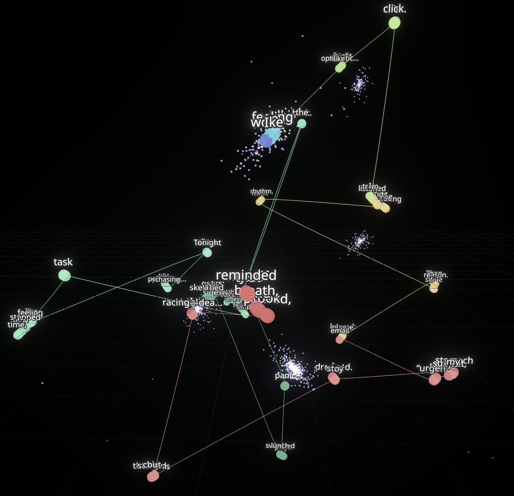

# 3D Trails

A locally runnable visualization app that transforms text into an interactive 3D semantic trail with particle effects. Watch your words flow through meaning space as a beautiful, animated 3D visualization.



## What It Does

Type any text and watch it transform into a flowing 3D trail through semantic space. Each word becomes a colored sphere positioned in 3D based on its meaning, connected by a smooth curve that shows how your thoughts evolve. The colors reflect sentiment and topic clusters, while particles swirl around semantic anchors, creating a living visualization of language.

### Example

Try this text to see the visualization in action:

> "I woke up feeling oddly optimistic, like today might finally click. On the train I listened to birds and street noise blending into a rhythm, and it made me smile for no reason. Then my phone buzzed: an email with "urgent" in the subject, and my stomach dropped. I tried to stay calm, but my thoughts started racing—deadlines, mistakes, what-ifs. I paused, took a breath, and reminded myself that panic isn't a plan. By lunch I switched gears: I sketched a small idea for a side project, something playful and creative, and the energy came back. In the afternoon I focused on one simple task at a time, and the day stopped feeling like a storm. Tonight I'm not chasing perfection—just progress, and a little peace."

Watch how the trail shifts from optimistic (bright colors) to anxious (darker tones) and back to calm, with each word positioned in 3D space based on its semantic meaning.

## Features

- **Text Embedding**: Compute embeddings per token/prefix using sentence-transformers
- **3D Projection**: Reduce embeddings to 3D using UMAP (with PCA fallback)
- **Sentiment Analysis**: Color-coded trail based on sentiment (VADER)
- **Topic Clustering**: KMeans clustering for topic-based color modulation
- **Particle System**: 1500+ particles attracted to semantic anchors with organic motion
- **Smooth Animation**: CatmullRom curves for fluid trail visualization
- **Word Labels**: Each sphere shows its word label on top
- **Post-processing**: Bloom effects for premium visual quality

## Tech Stack

- **Frontend**: React + Vite + TypeScript
- **3D Rendering**: @react-three/fiber + three.js + @react-three/drei
- **Post-processing**: @react-three/postprocessing (Bloom)
- **Backend**: Python FastAPI
- **Embeddings**: sentence-transformers (all-MiniLM-L6-v2)
- **Dimensionality Reduction**: UMAP (fallback: PCA)
- **Sentiment**: VADER (vaderSentiment)
- **Clustering**: scikit-learn KMeans

## Project Structure

```
3d-trails/
├── backend/
│   ├── main.py
│   └── requirements.txt
├── frontend/
│   ├── src/
│   │   ├── App.tsx
│   │   ├── Scene.tsx
│   │   ├── Trail.tsx
│   │   ├── Particles.tsx
│   │   ├── api.ts
│   │   ├── color.ts
│   │   ├── main.tsx
│   │   ├── App.css
│   │   └── index.css
│   ├── index.html
│   ├── package.json
│   ├── tsconfig.json
│   └── vite.config.ts
├── image.png
└── README.md
```

## Setup & Installation

### Prerequisites

- Python 3.8+ (use `python3` on macOS)
- Node.js 18+
- npm or yarn

**Note for macOS users:** The startup scripts automatically use `python3` and install dependencies directly to your system Python (no venv required).

### Quick Start (Recommended)

**Linux/macOS:**
```bash
# Terminal 1 - Backend
cd /Users/nithinyanna/Downloads/3d-trails
./start-backend.sh

# Terminal 2 - Frontend
cd /Users/nithinyanna/Downloads/3d-trails
./start-frontend.sh
```

**Windows:**
```cmd
REM Terminal 1 - Backend
cd 3d-trails
start-backend.bat

REM Terminal 2 - Frontend
cd 3d-trails
start-frontend.bat
```

### Manual Setup

#### Backend Setup

1. Navigate to the backend directory:
```bash
cd backend
```

2. Install dependencies:
```bash
python3 -m pip install --upgrade pip
python3 -m pip install -r requirements.txt
```

3. Start the FastAPI server:
```bash
python3 -m uvicorn main:app --reload --port 8000
```

The backend will be available at `http://localhost:8000`

#### Frontend Setup

1. Navigate to the frontend directory:
```bash
cd frontend
```

2. Install dependencies:
```bash
npm install
```

3. Start the development server:
```bash
npm run dev
```

The frontend will be available at `http://localhost:5173`

## Usage

1. Start both backend and frontend servers (see Setup above)
2. Open `http://localhost:5173` in your browser
3. Type text in the left panel textarea
4. Watch the 3D trail build as you type (debounced 400ms)
5. Adjust controls:
   - **Mode**: Switch between "prefix" (cumulative) or "token" (per-word) visualization
   - **Speed**: Control animation speed (0.2x to 3x)
   - **Show particles**: Toggle particle system (1500 swirling particles)
   - **Show anchor labels**: Display word labels on each sphere

## How It Works

1. **Text Processing**: Your text is split into tokens or cumulative prefixes
2. **Embedding**: Each fragment is converted to a high-dimensional vector using sentence-transformers
3. **3D Projection**: UMAP (or PCA) reduces the embeddings to 3D coordinates
4. **Sentiment Analysis**: VADER analyzes sentiment for each fragment
5. **Clustering**: KMeans groups similar meanings into clusters
6. **Visualization**: 
   - A smooth curve connects the points in 3D space
   - Each point is a colored sphere showing its word
   - Colors reflect sentiment (brightness) and topic (hue)
   - Particles swirl around semantic anchors

## API Contract

### POST `/embed`

**Request:**
```json
{
  "text": "your text here",
  "mode": "prefix" | "token"
}
```

**Response:**
```json
{
  "points": [
    {
      "x": 0.0,
      "y": 0.0,
      "z": 0.0,
      "text_fragment": "hello",
      "sentiment": 0.5,
      "cluster": 0
    }
  ],
  "anchors": [
    {
      "x": 0.0,
      "y": 0.0,
      "z": 0.0,
      "label": "hello world",
      "cluster": 0
    }
  ],
  "meta": {
    "n_points": 10,
    "n_clusters": 3
  }
}
```

## Color Mapping

- **Sentiment**: Controls brightness/saturation
  - Negative (-1): Dim, colder colors
  - Positive (+1): Bright, warmer colors
- **Cluster**: Controls base hue (distributed across color wheel)

## Performance Notes

- Particles use `BufferGeometry` for GPU-friendly rendering
- Animation uses `requestAnimationFrame` for smooth 60fps
- Debounced API calls (400ms) prevent excessive requests
- Post-processing bloom is optimized for performance
- High-resolution curves (300+ segments) for smooth trails

## Troubleshooting

### Port Already in Use

If you see "Address already in use" error:
```bash
# Kill processes on port 8000
lsof -ti:8000 | xargs kill -9

# Or use a different port
python3 -m uvicorn main:app --reload --port 8001
```

### UMAP Installation Issues

If UMAP fails to install, the app will automatically fall back to PCA. This is handled gracefully in the code.

### CORS Errors

The backend CORS middleware is configured to allow `http://localhost:5173`. If you see CORS errors, ensure both servers are running on the correct ports.

### Port Conflicts

If ports 8000 or 5173 are in use, modify:
- Backend: Change port in `uvicorn` command
- Frontend: Change port in `vite.config.ts` or use `--port` flag

## Development

### Backend Development

```bash
cd backend
python3 -m uvicorn main:app --reload --port 8000
```

### Frontend Development

```bash
cd frontend
npm run dev
```

### Building for Production

```bash
cd frontend
npm run build
```


## License

MIT
